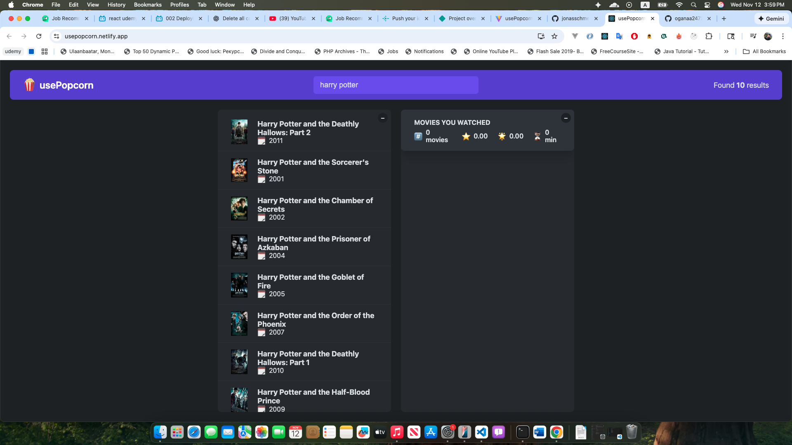

# Movie List App

A simple React application to display a list of movies.  
This project demonstrates the usage of **useEffect**, **data fetching**, and **custom hooks**.

---

## Features

- Fetch movies from an API
- Display movie list with title, poster, and rating
- Search movies by title
- Uses a **custom hook** for fetching data

---

## Technologies Used

- React
- JavaScript (ES6+)
- Axios (for API requests)
- CSS for styling

---
Check it out here: [Movie List App](https://usepopcorn.netlify.app/)



## Installation

1. Clone the repository:
```bash
git clone https://github.com/oganaa2472/usepopcorn